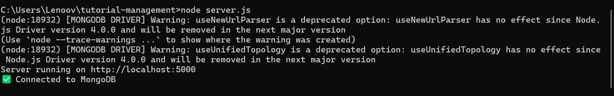
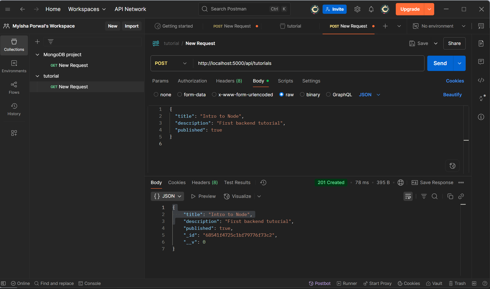
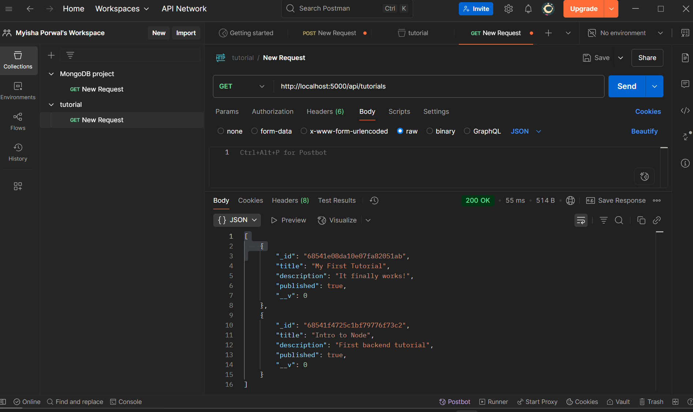

# Tutorial Management System (Backend)

This is a simple backend project built using Node.js, Express.js, and MongoDB.  
It provides a RESTful API for creating, reading, updating, and deleting tutorials.

## Features

- Create a new tutorial
- Retrieve all tutorials
- Update an existing tutorial
- Delete a tutorial

## Technologies Used

- Node.js
- Express.js
- MongoDB
- Mongoose
- Postman (for API testing)

## Getting Started

### Prerequisites

- Node.js installed
- MongoDB installed and running locally or an Atlas URI
- Git (for version control)

### Installation

1. Clone the repository:

```bash
git clone https://github.com/your-username/tutorial-management.git
cd tutorial-management


1. Install dependencies:
npm install

2. Configure the environment:
Create a .env file in the root folder and add your MongoDB connection string:
MONGO_URI=mongodb://127.0.0.1:27017/tutorialDB

3.Start the server:
node server.js

Screenshots

### Server Running


### Add Tutorial (POST)


### Get All Tutorials (GET)



Author 
**Myisha Porwal**  
[GitHub](https://github.com/Myisha-Porwal-23BCE11519)  
  
